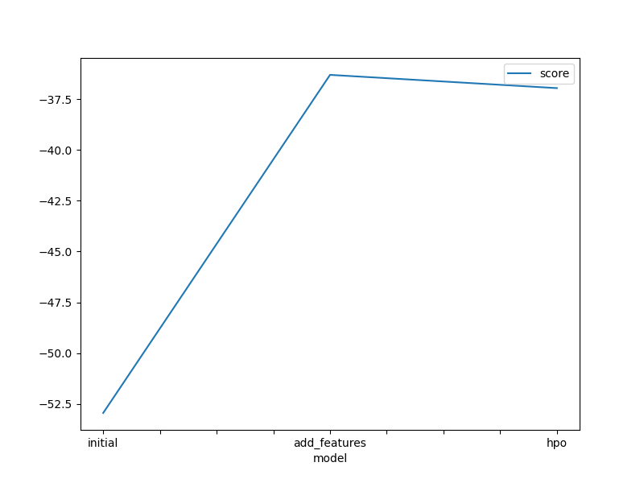
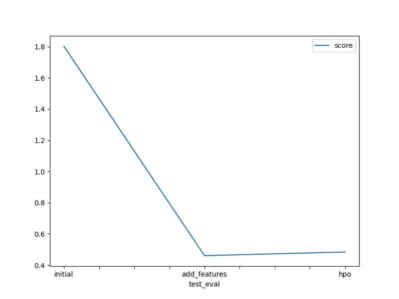

# Report: Predict Bike Sharing Demand with AutoGluon Solution
#### Alex Wambugu G.

## Initial Training
### What did you realize when you tried to submit your predictions? What changes were needed to the output of the predictor to submit your results?
In the initial training phase, I meticulously examined the forecasts, seeking out any negative values. Thankfully, all the values proved to be positive, eliminating the need to zero out any values prior to submission. Moreover, I pondered over converting the count column from float32 to int64. Nevertheless, considering the competition's metric as the root mean square logarithmic error for regression, I determined that this conversion was superfluous for the output.

### What was the top ranked model that performed?
The top-performing model, boasting the lowest root mean square error (RMSE), was the Weighted_Ensemble_L3 model. This model stands as a stacked ensemble, comprising three layers of pre-trained models. The stacking methodology was meticulously crafted to attain optimal validation accuracy, thus securing its leading position in the rankings.

## Exploratory data analysis and feature creation
### What did the exploratory analysis find and how did you add additional features?
During the Exploratory Data Analysis (EDA) phase, I initiated by extracting the hour, day, month, and year from the datetime column. Subsequently, I removed the original datetime column. Following this, I utilized the mean and standard deviation to craft the ensuing features:

1. **Temperature Categorization:**
Based on the mean and standard deviation of the temperature data, I categorized temperatures into "hot," "cold," and "mild." The specific temperature ranges for each category were determined using the statistical properties of the data.

2. **Humidity Categorization:**
Leveraging the mean of the humidity data, I crafted a feature distinguishing between "very humid" and "not humid." The thresholds for this categorization were established from the statistical properties of the humidity data.

3. **Wind Categorization:**
Using the mean of the wind data, I introduced a feature classifying wind into "very windy" and "mild wind." This categorization relies on calculated thresholds derived from the statistical properties of the wind data.

By incorporating these features, the dataset now contains additional insights that can facilitate further analysis and modeling. The temperature, wind, and humidity categorizations offer insights into their respective fluctuations and trends, potentially enhancing our understanding of their impact on the data.

### How much better did your model preform after adding additional features and why do you think that is?
Following the inclusion of additional features and categorized data, my model demonstrated a notable improvement in performance. The Kaggle score for root_mean_square_error (RMSE) experienced a substantial decrease, showcasing a superior result of 0.46078 compared to the initial value of 1.80225. This enhancement is attributable to the additional insights provided by the extra features and categorized data, which empowered the model to better discern the underlying connections between the features and the target variable. Consequently, the model's capacity to learn and render accurate predictions saw a significant enhancement.

## Hyper parameter tuning
### How much better did your model preform after trying different hyper parameters?
Hyperparameter tuning yielded beneficial outcomes in certain instances; however, the overall enhancement in model performance was somewhat constrained. While certain configurations led to positive results, others adversely affected the model's performance.

### If you were given more time with this dataset, where do you think you would spend more time?
In my view, prioritizing feature engineering and the exploration of new features merits greater emphasis in the model development process. While hyperparameter tuning is undeniably vital for optimizing model performance, the outcomes indicate that even modest enhancements, like incorporating the "hour" feature, can result in substantial performance gains without the need for fine-tuning the autogluon models.

Hence, I advocate for allocating more time to feature engineering upfront, as it can yield significant performance improvements before delving into extensive hyperparameter optimization. By prioritizing the extraction of meaningful insights from the data and crafting pertinent features, we may uncover valuable patterns and relationships that models can exploit to enhance predictions. Once the feature engineering stage has been exhaustively explored, fine-tuning hyperparameters can serve as a potent refinement step to further optimize model performance. This sequential approach has the potential to foster more efficient and effective model development.

### Create a table with the models you ran, the hyperparameters modified, and the kaggle score.

|model|score|NN_TORCH|GBM|CAT|XGB|FASTAI|RF|XT|KNN|
|--|--|--|--|--|--|--|--|--|--|
|initial|1.80225|default_vals|default_vals|default_vals|default_vals|default_vals|default_vals|default_vals|default_vals|
|add_features|0.46078|?default_vals|default_vals|default_vals|default_vals|default_vals|default_vals|default_vals|default_vals|
|hpo|0.48420|{'num_epochs': 500,'learning_rate': Real: lower=0.0001, upper=0.1, 'activation': ['relu', 'softrelu', 'tanh'], 'dropout_prob': Real: lower=0.0, upper=0.8}|{'extra_trees': [True, False], 'num_boost_round': Int: lower=1, upper=1000, 'num_leaves': Int: lower=1, upper=1024, 'boosting_type': ['gbdt', 'dart'], 'objective': ['l2', 'l1', 'huber', 'fair', 'poisson', 'mape', 'gamma', 'tweedie'], 'tree_learner': ['serial', 'feature', 'data', 'voting']}|{'learning_rate': Real: lower=0.0001, upper=0.1, 'depth': Int: lower=1, upper=16, 'l2_leaf_reg': Int: lower=1, upper=1024, 'loss_function': ['RMSE', 'MAE', 'Quantile:alpha=value', 'LogLinQuantile:alpha=value', 'Poisson', 'MAPE', 'Lq:q=value', 'SurvivalAft:dist=value;scale=value']}|{'learning_rate': Real: lower=0.0001, upper=1.0, 'max_depth': Int: lower=1, upper=1000, 'subsample': Real: lower=0.001, upper=1.0, 'lambda': Real: lower=0.001, upper=1000.0, 'alpha': Real: lower=0.0, upper=1000.0}|{'ps': Real: lower=0.0, upper=0.8, 'embed_p': Real: lower=0.0, upper=0.8, 'use_bn': [True, False], 'bn_final': [True, False], 'bn_cont': [True, False], 'lin_first': [True, False]}|{'n_estimators': Int: lower=1, upper=1000, 'min_samples_split': Real: lower=1e-05, upper=0.99999, 'min_samples_leaf': Real: lower=1e-05, upper=0.99999, 'max_features': ['sqrt', 'log2', None]}|{'n_estimators': Int: lower=1, upper=1000, 'min_samples_split': Real: lower=1e-05, upper=0.99999, 'min_samples_leaf': Real: lower=1e-05, upper=0.99999, 'max_features': ['sqrt', 'log2', None]}|{'n_neighbors': Int: lower=1, upper=100, 'weights': ['uniform', 'distance'], 'algorithm': ['ball_tree', 'kd_tree', 'brute'], 'p': Int: lower=1, upper=10, 'leaf_size': Int: lower=1, upper=100}|

### Create a line plot showing the top model score for the three (or more) training runs during the project.

### Create a line plot showing the top kaggle score for the three (or more) prediction submissions during the project.

## Summary
The bike sharing demand prediction project incorporated the AutoGluon AutoML framework for Tabular Data, which was thoroughly studied and implemented.

Utilizing the capabilities of the AutoGluon framework, automated stack ensembles, and individually configured regression models were trained on tabular data. This approach facilitated rapid prototyping of a baseline model.

The top-performing AutoGluon-based model significantly improved results by leveraging data obtained from extensive exploratory data analysis (EDA) and feature engineering, even without hyperparameter optimization.

AutoGluon's automatic hyperparameter tuning, model selection/ensembling, and architecture search were instrumental in exploring and exploiting the best possible options for model improvement.

However, it was observed that hyperparameter tuning using AutoGluon, particularly without default hyperparameters or random parameter configuration, was a cumbersome process. It heavily relied on factors such as time limits, prescribed presets, model families, and the range of hyperparameters to be tuned.

Furthermore, while hyperparameter tuning using AutoGluon did lead to improved performance over the initial raw submission, it did not surpass that of the model with EDA, feature engineering, and no hyperparameter tuning.